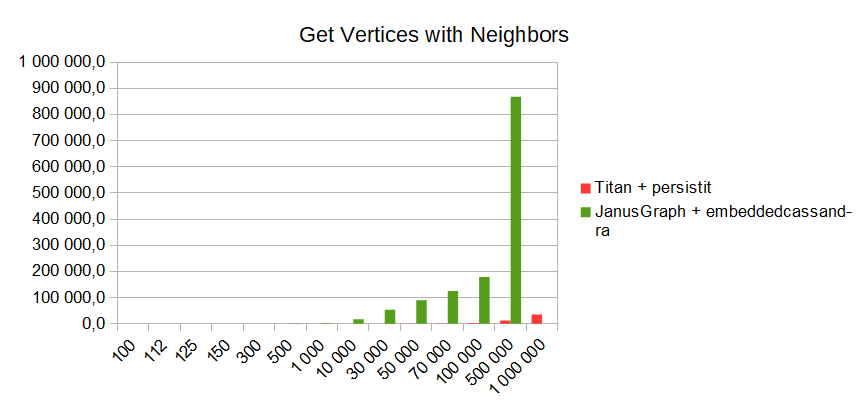
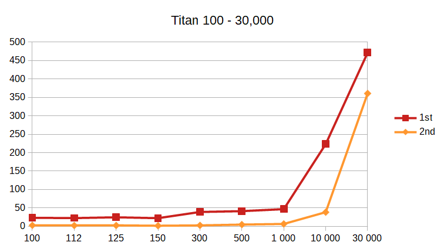

# Results

This page introduces current results of the benchmark and given tests and databases.
First, the general info about the setting and environment is provided, followed by
the individual tests and their results.

## Measurements

The measurements were run on 
* Titan, version 0.4.4 + Persistit, version 3.3.0
* JanusGraph, version 0.3.2 + Cassandra, version 2.1.20 (the version for the embedded connection type)
* corresponding settings and indices in both cases
* disabled cache (simulating an environment where we cannot fit everything we need in memory)
* DELL Latitude 5590 (CPU: i7-8650U, GPU: Intel Graphics 620, RAM 16GB, SSD: 512 GB)

All the results are averaged from at least five individual runs.

The results can be found in the file [results.xlsx](./results.xlsx).

It contains all the numbers and charts for the basic operations of
* **import** - import a graph of a given number of vertices and edges
* **getVertices** - find all vertices of the graph. The cache is disabled and each search for each
 vertex is called separately
* **getVerticesWithEdges** - similar to getVertices, only this time all edges of a given vertex
 are found as well
* **getVerticesWithNeighbors** - similar to getVertices, only this time all neighbors of a given
 vertex are found as well

### Import

The chart below shows the import time in milliseconds (y-axis) based on the number of nodes in
the graph (x-axis). The second chart represents a detail of the first chart with a focus on
smaller graphs for which the results are not visible in the first chart. The detailed numbers
can be found in the attached file above.

The import times of JanusGraph (with embedded Cassandra, that is, the fastest possible
connection with Cassandra which is possible) are unacceptable. We followed
recommendations for bulk loading both from the
[official sources](https://docs.janusgraph.org/advanced-topics/bulk-loading/) and various
tuning guides (both JanusGraph and Cassandra related).

### Get Vertices

The test gets each vertex of the graph individually while the cache is off 
(for further information on cache follow the [Off-Cache section](#off-cache)). Similarly 
to import charts, the getVertices charts contain the number of vertices on the 
x-axis and time in milliseconds on the y-axis.

The times for retrieval of all vertices, one by one,  in JanusGraph is very 
similar to the ones in Titan. The main reason for that is the index backend, 
Lucene in both cases.

### Get Vertices with Edges

The JanusGraph data model is just the same as the data model of Titan, which suggests 
that retrieval of vertices with their edges should be similar in both the cases. 
However, some severe performance flaws are present when 
comparing it with the Titan.

The JanusGraph is significantly slower than the Titan. Values of by what number 
of times the Titan was faster than the JanusGraph (y-axis) based on the number 
of vertices (x-axis) is displayed in the following chart.

It’s worth mentioning that in both cases the same indices were created. There 
have been some changes in internal data storing between Titan, 0.4.4 and JanusGraph, 
0.3.2, and most likely several other adjustments that lead to the current behavior.

### Get Vertices with Neighbors

First, an unexpected behavior was spotted, 
which is further described in the [Off-Cache section](#off-cache) - the first run of the 
*getVerticesWithEdges* was significantly slower than any other run of 
*getVerticesWithEdges*/*getVerticesWithNeighbors*. 
Therefore, the results of the deviating first runs were omitted from the averages 
and the behavior was inspected separately.

As would be expected, the results are similar to those found in the 
*getVerticesWithEdges* test.

### Off-Cache

Although both the Titan and the JanusGraph were set with disabled cache, the 
first run of a test requiring a search of additional features (*getVertexWithEdges*, 
*getVertexWithNeighbors*) runs significantly slower than the following tests, 
including the first test repeated. This behavior could be explained as an initial 
cache load, followed by tests searching in that cache. Therefore, it seems that even 
though the settings disabled the cache, there is still some portion of an internal 
cache that cannot be influenced (perhaps a cache of a storage backend that cannot be 
disabled).

JanusGraph seems to have this cache behavior only with small graphs as seen in the 
following chart depicting the 1st and the 2nd run of the *getVertexWithEdges* test 
(x-axis with the number of graph vertices, y-axis with the time in milliseconds).

With the small graph, the difference between the 1st and the 2nd run is about 73%. 
However, with the growing graph, the difference gets smaller and it’s diminished 
already at the size of 150 vertices.

Titan, on the other hand, keeps the difference over 80% up to the size of a 
10,000-vertex graph. After that, it still keeps that behavior, but with a lower 
difference under 35%.

To sum it up, the JanusGraph behavior in these matters is not that different from 
the Titan one.  With medium and large graphs it behaves as expected. Therefore, it 
seems, that the cache that cannot be influenced is larger in the Titan than in the 
JanusGraph.

### Interim Conclusion

So far we would not select the JanusGraph as a suitable candidate for our internal 
graph database. The import times are significantly slower, as well as the time of 
tests requiring retrieval of other elements.
